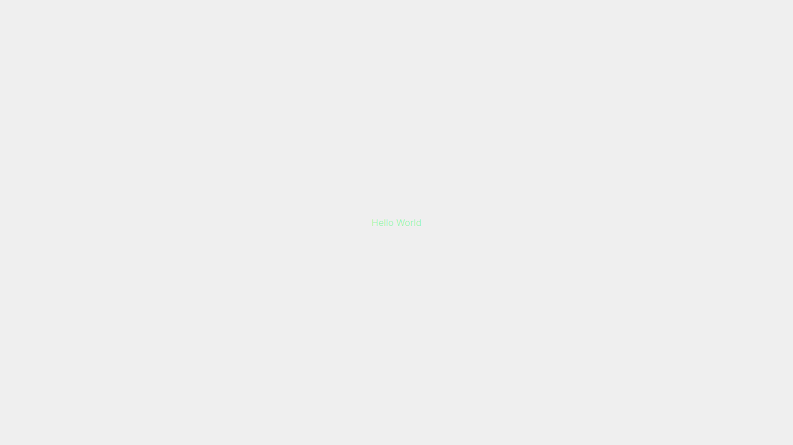
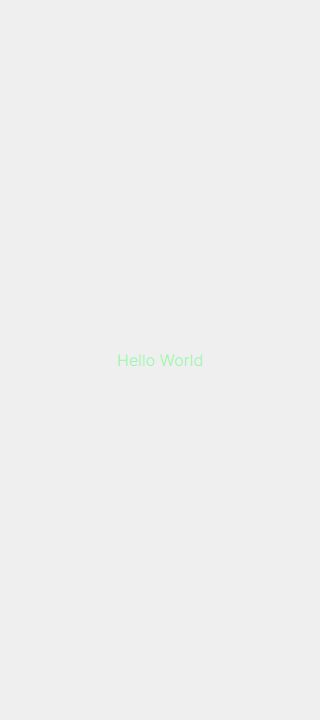

<h1 align="center">
    
</h1>
<h4 align="center">🚧 Projeto em construção 🚧</h4><!-- Delete this line later -->
<p align="center">
    
    
    
    <a href="https://github.com/ignitedevclub/project-1-frontend/blob/main/LICENCE">
        
    </a>
</p>
<p align="center">
    <a href="#project-1-frontend-">Projeto</a>&nbsp;&nbsp;&nbsp;|&nbsp;&nbsp;&nbsp;
    <a href="#tecnologias-">Tecnologias</a>&nbsp;&nbsp;&nbsp;|&nbsp;&nbsp;&nbsp;
    <a href="#layout-">Layout</a>&nbsp;&nbsp;&nbsp;|&nbsp;&nbsp;&nbsp;
    <a href="#licença-%EF%B8%8F">Licença</a>
</p>

# Project-1-frontend 
Projeto desenvolvido para gerenciar melhor os seus estudos. Projeto realizado pela equipe @IgniteDevClub.

<br>

<details>
    <summary>Como é a nosso app</summary>

```
Descrição...
```
</details>

<details>
    <summary>Vantagens de usar project-1-frontend</summary>

```
- Aumenta o foco e a concentração por meio da redução das interrupções.
- Aumenta a motivação e mantém-na constante.
- Reforça a determinação para atingir os objetivos.
- Melhora o processo de trabalho ou estudo.
- Reforça sua determinação de continuar a aplicar-se em face de complexas situações.
```
</details>

<br>

#### Funcionalidades
* Dark Mode
* Site responsivo
* ~
* ~
* ~

<details>
    <summary>Desafios</summary>

```
✔ - Documentar bem o projeto
✖ - Melhorar o estilo: Responsividade e Design
✖ - Bloquear funcionalidades especiais se não estiver logado
✖ - Banco de dados
✖ - API-REST
✖ - Next PWA

Funcionalidades:
    ✖ - Trocar o tema da aplicação: Light e Dark
    ✖ - Consumo de api-rest
    ✖ - Banco de dados (~DB)
    ✖ - oAuth (Pagina de login)
    ✖ - COOKIES:
        ✖ - Cookies consent
        ✖ - Guardar dados
        ✖ - Alterar dados
        ✖ - Deletar dados
    ✖ - ~DB:
        ✖ - Guardar dados
        ✖ - Alterar dados
        ✖ - Deletar dados
    ✖ - Telas:
        ✔ - Home
        ✖ - Settings
        ✖ - Login
        ✖ - 404
    .
    .
    .
```
</details>

## Tecnologias 🚀
Esse projeto foi desenvolvido com as seguintes tecnologias:
- [NextJS | 12.1.0](https://nextjs.org/)
- [ReactJS | 17.0.2](https://pt-br.reactjs.org/)
- [Typescript | 4.6.2](https://www.typescriptlang.org/)
- [Sass | ^1.49.9](https://sass-lang.com/)

## Layout 🚧
### Desktop Screenshot
<div style="display: flex; flex-direction: 'column'; align-items: 'center';">
<!-- Responsive, 1366 x 768, 50% (Laptop L - 1366px)-->
    
    <!---->
</div>
<a href=".github/README-IMGS.md">Ver mais</a>

### Mobile Screenshot
<div style="display: flex; flex-direction: 'row';">
<!-- Responsive, 320 x 720, 75% (Mobile L - 320px)-->
    
    <!---->
</div>
<a href=".github/README-IMGS.md">Ver mais</a>

## Rodando o projeto 🚴🏻‍♂️
#### "Só vou dar uma olhadinha...":
  <a href="https://project-1-frontend.vercel.app/">✏ Site hospedado na Vercel 📚</a>

#### Na sua maquina:
<details>
    <summary>Dependências</summary>

```json
  "dependencies": {
    "next": "12.1.0",
    "next-themes": "^0.1.1",
    "react": "17.0.2",
    "react-dom": "17.0.2",
    "sass": "^1.49.9"
  },
  "devDependencies": {
    "@types/node": "17.0.21",
    "@types/react": "17.0.40",
    "eslint": "8.11.0",
    "eslint-config-next": "12.1.0",
    "next-sitemap": "^2.5.10",
    "typescript": "4.6.2"
  }
```
> Ex: `$ yarn add _____` para instalar as dependências

> Utilize a tag `-D` para instalar as dependências de desenvolvimento.
> Utilize a tag `@types` para instalar o suporte a Typescript.
> Utilize a tag `@latest` para instalar a versão mais recente.
</details>

```bash
# Clone o repositório
$ git clone https://github.com/ignitedevclub/project-1-frontend.git

# Acesse a pasta do projeto no prompt de comando
$ cd project-1-frontend

# Instale as dependências
$ yarn add

# Execute o script "dev"
$ yarn dev

# O projeto inciará na porta: 3000 - acesse http://localhost:3000
```

## Contribuição 💭
Para construir esse projeto formamos uma equipe no Discord (IgniteDevClub), com objetivo de aprimorar nossas habilidades técnicas e não técnicas. Quer [contribuir](https://github.com/ignitedevclub/project-1-frontend/blob/main/CONTRIBUTING.md) para esse projeto? Então envie seu Pull Request.

## Licença ⚖️
Este projeto está sob a licença do MIT. Veja o arquivo [LICENSE](https://github.com/ignitedevclub/project-1-frontend/blob/main/LICENCE) para mais detalhes.